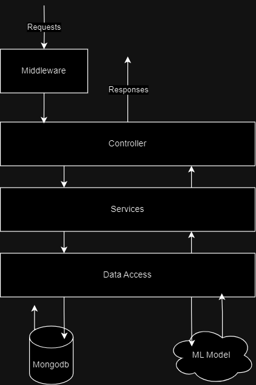
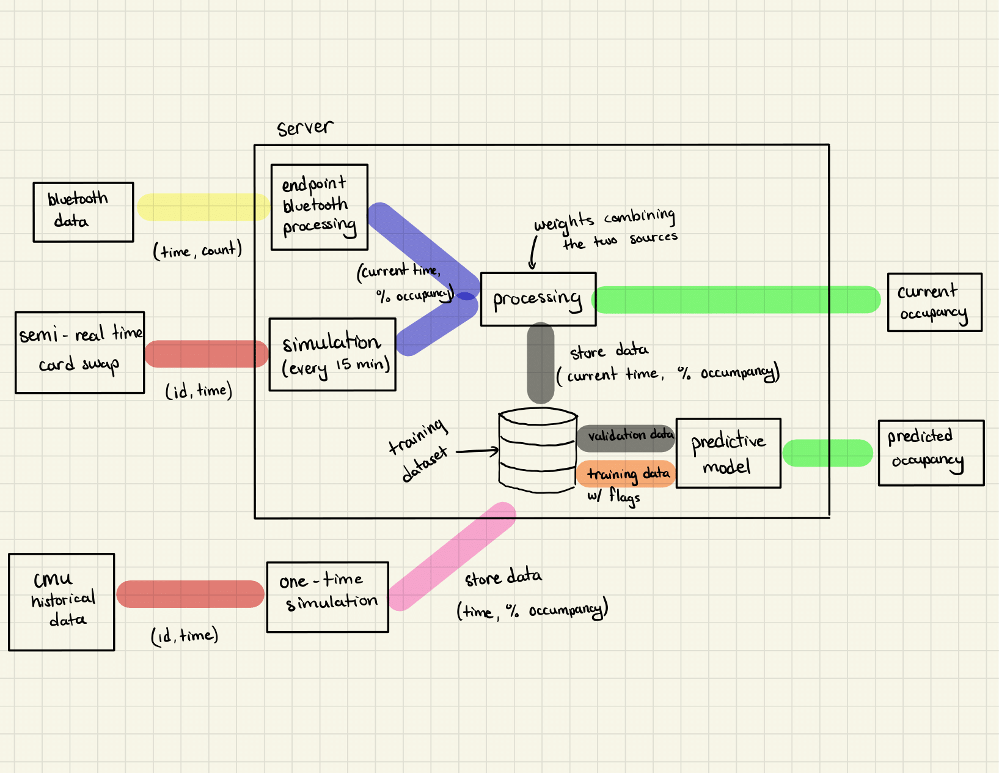

## Architecture Overview

### Middleware
It acts as a bridge or intermediary that helps manage communication, handle requests, and streamline the flow of data between different components of a server-based application. Here are some key functions of middleware:

**Authentication and Authorization:** Handles user authentication and authorization. It verifies the identity of users and checks whether they have the necessary permissions to access certain resources or perform specific actions.

**Caching:** Middleware may implement caching mechanisms to store frequently requested data or responses. This can significantly improve the performance of the server by reducing the need to recompute or retrieve data from the underlying systems.

### Controller
Manages the flow of data and controlling the interactions between the model and the view. The primary function of the controller is to handle user input, process it, and update the model and view accordingly. 

### Services
Should contain all business logic, validating requests, throwing error. Think of it was the middleman between controller and data access layer and processes requests and retrieves requested data.

### Data Access
APIs to communicate to MongoDB database and ML model.